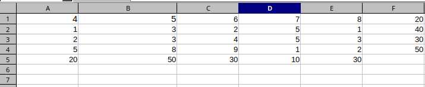
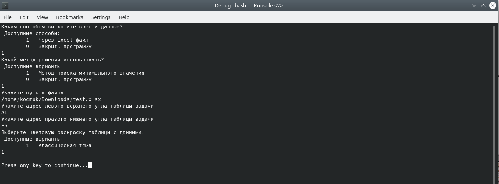
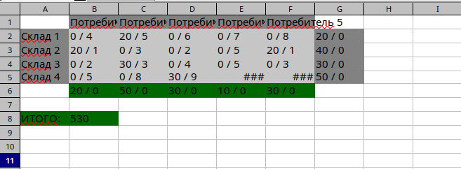

= Программа по решению транспортных задач
Konstantin Maltsev
:toc: left
:toc-title: Оглавление

== Скриншоты результатов работы программы

=== Ввод данных
Интерфейсы программы позволяют написать код для ввода данных любым способом. Но на данный момент реализован только способ по вводу из excel файла

==== Ввод в Excel файле

Нужно ввести таблицу ровно такую, как была бы представлена в виде условия к транспортной задаче
Где

*Gо центру* указаны _цены_ на перевозки

*Нижняя строка* _Потребители_ - необходимое им кол-во товара

*Правый столбец* _Склады_ - количество на складе

=== Интерфейс программы

На данный момент это консольная программа. Диалог с пользователем выглядит следующим образом:

* Выбирается способ ввода данных - это то, что описано выше. На данный момент доступен только ввод из excel файла
* Выбирается способ решения программы - на данный момент существует __Метод поиска минимального значения__
* Далее происходит процесс поиска решения
* После чего предлагается выбрать цветовую схему результата - сейчас доступна только _Классическая_

=== Выходные данные

На данный момент это только excel файл

IMPORTANT: Сейчас в программе указан абсолютный путь на выходной файл - нужно будет переопределить, если Вы захотите проверить работу программы.

* *Склады* результат __<Количество отправленного товара> / <Количество оставшегося товара>__
* *Цены* результат __<Количество отправленного товара> / <Цена отправленного товара> __
* *Потребитель* результат __<Количество полученного товара> / <Неудовлетворенный спрос>__

WARNING: Тут у меня LibreOffice косячи - пытается вместо текстового значения подставить даты в некоторых ячейках - значение с # - надеюсь, Microsoft не настолько убог будет

=== Видеоотчет

++++
<iframe width="1078" height="480" src="https://www.youtube.com/embed/7NQcfSUdufA" frameborder="0" allow="autoplay; encrypted-media" allowfullscreen></iframe>
++++
Если видео не открывается отсюда, предлагаю ссылку на него в google-drive
https://drive.google.com/file/d/1m1JUJvV6oNpTAh-g1SWgKIobi1_9EM1R/view?usp=sharing

== Схема классов

=== Модель данных

==== Модель результата вывода

[plantuml, format="svg"]
----

PrettyResult --* PrettyResultCell
class PrettyResult{
    + PrettyResultCell[,] resultTable
}

enum CellType {
    HEADER,
    DATA,
    ERROR,
    SUCCESS,
    TOTAL
}

PrettyResultCell --* CellType
class PrettyResultCell {
    + string value,
    + CellType type
}

OutputTheme --* CellType
interface OutputTheme {
    + string getColor(CellType cellType)
}

class CustomOutputTheme implements OutputTheme {
    string headerColor,
    string dataColor,
    string errorColor,
    string successColor,
    string totalColor
}

class ClassicOutputTheme extends CustomOutputTheme {
    string headerColor = #828282,
    string dataColor  = #c6c6c6,
    string errorColor  = #e90046,
    string successColor = #006800,
    string totalColor = #006800
}
----

==== Модель условия задачи

[plantuml, format="svg"]
----
class ProblemTable {
    + double[,] prices
    + int[] warehouses
    + int[] consumers
}
----

==== Модель решенной задачи

[plantuml, format="svg"]
----
ResolvedTable --* ResolvedConsumer
ResolvedTable --* ResolvedWarehouse
ResolvedTable --* ResolvedDataCell
class ResolvedTable {
    + ResolvedDataCell[,] consumed
    + ResolvedConsumer[] consumers
    + ResolvedWarehouse[] warehouses

    + bool isResolved()
    + PrettyResult toPrettyResult()
}

class ResolvedConsumer {
    - int required
    - int delivered = 0

    + void setRequired(int required)
    + int getRequired()
    + int getDelivered()
    + void resolveByValue(int value)
    + bool isSatisfied()
}

class ResolvedWarehouse {
    - int total
    - int used = 0

    + int getTotal()
    + int getUsed()
    + void setTotal(int total)
    + void resolveByValue(int value)
}

class ResolvedDataCell {
    - double price
    - int usage = 0

    + int getUsage()
    + void setUsage(int value)
    + double getUsagePrice()
}
----

=== Схема классов

[plantuml, format="svg"]
----
interface ITransportProblem {
    + ResolvedTable calculate(ProblemTable problemTable)
}

class PolarTransportProblemResolver implements ITransportProblem

ExcelDataInput --* ExcelFileReader
interface ExcelDataInput {
    + ExcelFileReader openFile(String filePath);
}

ExcelFileReader --* ExcelSheetReader
interface ExcelFileReader {
        + ExcelSheetReader getSheet(int sheetNumber);
}

interface ExcelSheetReader {
        + int readInt(CellAddress address);
        + String readString(CellAddress address);
        + object readObject(CellAddress address);
        + object[,] readRange(CellRange range);
}

class IronExcelDataInput implements ExcelDataInput

class IronExcelFileReader implements ExcelFileReader

class IronExcelSheetReader implements ExcelSheetReader

interface IProblemInput {
    + ProblemTable getProblemTable();
}

ExcelSimpleProblemInput --* ExcelDataInput
class ExcelSimpleProblemInput implements IProblemInput {
    - ExcelDataInput inputSource;
}

interface ExcelDataOutput {
    + void writeResult(int startRow, PrettyResult prettyResult, OutputTheme theme);
}

class IronExcelDataOutput implements ExcelDataOutput {
    - WorkBook wb
    - WorkSheet workSheet
    - string filePath
}

MainClass --* ExcelDataOutput
MainClass --* IProblemInput
MainClass --* ITransportProblem
class MainClass #fff {
    + static void Main(string[] args)
    - static IProblemInput getProblemInput()
    - static ITransportProblem getProblemResolver()
    - static OutputTheme getOutputTheme()
}

----

== Алгоритмы

=== Алгоритм поиска решения методом минимальных значений

==== Основной алгоритм
[source, java]
----
ResolvedTable ITransportProblem.calculate(ProblemTable problemTable)
        {
            ResolvedTable resolvedTable = new ResolvedTable(problemTable);
            while(!resolvedTable.isResolved()) {
                CellAddress minAddress = findNextMinimum(problemTable, resolvedTable);
                int usage = Math.Min(
                    resolvedTable.warehouses[minAddress.row].getTotal(),
                    resolvedTable.consumers[minAddress.column].getRequired()
                );
                resolvedTable.consumed[minAddress.row, minAddress.column].setUsage(usage);
                resolvedTable.warehouses[minAddress.row].resolveByValue(usage);
                resolvedTable.consumers[minAddress.column].resolveByValue(usage);
            }
            return resolvedTable;
        }
----

==== Поиск минимума
[source, java]
----
private CellAddress findNextMinimum(ProblemTable problemTable, ResolvedTable resolvedTable) {
            double minimum = Double.MaxValue;
            CellAddress minCellAddress = null;
            double[,] prices = problemTable.prices;

            for (int i = 0; i < prices.GetLength(0); i++)
            {
                if (resolvedTable.warehouses[i].getTotal() == 0)
                    continue;

                for (int j = 0; j < prices.GetLength(1); j++)
                {
                    if (resolvedTable.consumers[j].getRequired() == 0)
                        continue;

                    if(minimum > prices[i, j] && resolvedTable.consumed[i, j].getUsage() == 0) {
                        minimum = prices[i, j];
                        minCellAddress = new CellAddress(i, j);
                    }
                }
            }
            if (minCellAddress == null)
                throw new InvalidOperationException("The resolved table is full");
            return minCellAddress;
        }
----

== Ошибки выполнения
В программе предусмотрены кастомные исключения. Ниже - их описание

* _MalformedProblemTableException_ - таблица условия задачи имеет некорректный вид (размеры, соотношения и т.п.)
* _InternalCalculationError_ - Внутренняя ошибка расчетов
* _InvalidValueSpecified_ - в таблицу условия попал неожиданный символ
* _InvalidTableRangeInput_ - При вводе диапазона excel была выбрана неверная зона
** Строка на потребителей и как минимум 2 строки на цены, иначе, задача не имеет смысла
** Столбец на склады и как минимум два столбца на цены, иначе задача смысла не имеет
